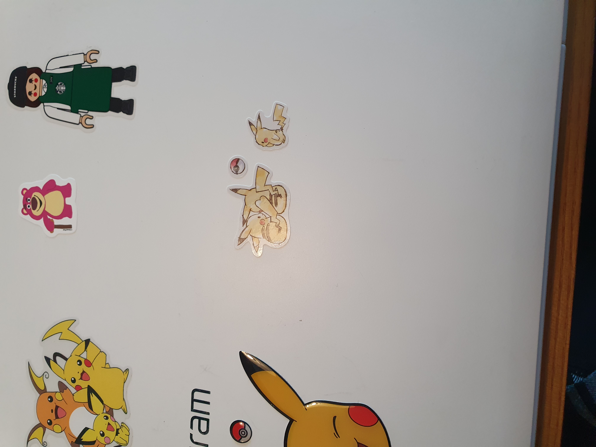
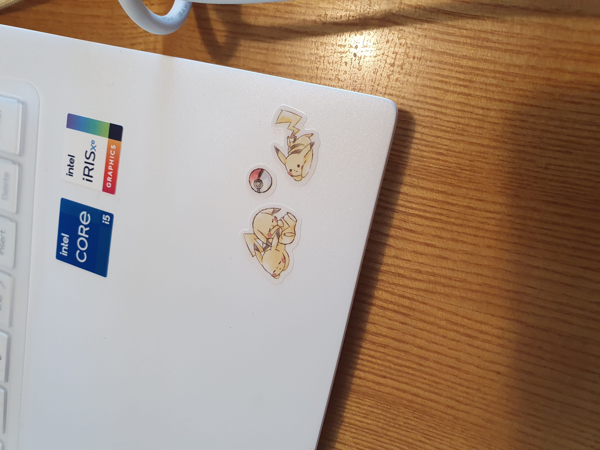

부스트캠프에서의 레벨1이 끝났다...! :cry:
이번주는 product serving과 관련된 강의를 들었는데 리눅스나 도커 등은 처음 접하는 내용이여서 공부하는데 어려움이 있었다.
streamlit의 경우에도 아직 버전 오류가 해결되지 않아서 제대로 실행시켜보지 못하고있다 ㅠㅠㅠㅠ
틈틈히 다시 도전해보아야겠다.
아 그리고 한권으로 읽는 컴퓨터 구조와 프로그래밍이라는 책을 구매했다.
컴퓨터의 구조부터 공부해보고 싶고 뭔가 근본적인 것?부터 공부하고 싶어서 사게 되었다. 빨리 마스터하고싶다!!
금요일에는 레벨1 팀원들과 빠이빠이 모임을 가졌다. 고기랑 술을 먹었고 재미있게 이야기하다 헤어졌다.
2달동안 너무 고생했어요!! 우리팀!!
그리고 한정님이 피카츄 스티커를 일본에서 구입해오셨다!! 감사합니다 한정님!!
다음주부터 레벨2가 시작된다.
기대되기도 하지만 내가 잘 해낼 수 있을지에 대한 걱정도 있다.
공부해야 할 것들도 많고 ㅠㅠ 열심히 해보자!!
화이팅!!!!! :fire::fire:

