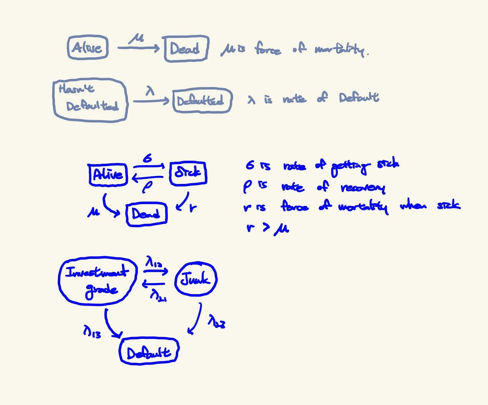

---

title: "Theory of Credit Risk Model"

categories:

- RISK

toc: true
toc_sticky: true

date: 2023-12-29
last_modified_at: 2023-01-10

## Risk

**Consequences of Uncertainty**

### Dimensions of Risk

- Event: what has to happen for the Risk to occur
- Duration: for how long are we exposed to this Risk
- Frequency: Probability or Rate of the Risk event occuring
- Severity: Magnitude of the consequences
- Correlation: Relationship with other Risk Events
- Capital: Reseves needed to support Risk

### Uncertainty to each dimension

- Event: The cause could be uncertain
- Duration: The exposure could be uncertain
- Frequency: The true prob / rate could be uncertain
- Severity: The size of consequence could be uncertain
- Correlation: Relationships could be uncertain and subject to change
- Capital: Reserves might only give a level of confidence and not certainty

### For Example) Life Insurance

- Exclusions to control for event uncertainty
- Term Assurance to control for duration uncertainty
- Actuarial Modeling to try reduce rate uncertainty
- Fixed Benefits to control severity uncertainty
- Sell Life Annuities to get diversification and offsetting benefits
- Pool multiple similar risks to increase capital confidence(Flip coin)

### STANDARD APPROACH

1. Observe a population of size n for duration T

2. Count number of risk events that occur over duration T

   $$Frequency = \frac{\#\ of\ risk\ events}{n} $$

3. Observe size of loss from each risk event over duration T

   $$Severity = \frac{\sum\\of\ all\ losses}{\#\ of\ risk\ events}$$

   $$Risk\ Price=Severity\times Frequncy$$

### WHY MEASURE RISK

- Measuring Risk helps us to Manage it efficiently

- low frequency & low severity: Retain
- low frequency & high severity: Transfer
- high frequency & low severity: Control
- high frequency & high severity: Avoid

1. Do I want to take this Risk?
2. How much should I pay to transfer it? What is a fair premium?
3. What should my internal control budget be?
4. How much capital do I need to retain this Risk?

### Mathematical Properties of Risk Measures

- **Coherent**: logical and consistenct

- **Coherent Axioms**

  - Monotonicity: $if\ x_1 \lt x_2,\ then\ f(x_1) \lt f(x_2)$

  - Subadditivity: $f(x_1+x_2) \le f(x_1)+f(x_2)$

  - Positive Homogeneity: $f(kx)=kf(x)\ (k\ is\ a\ positive\ constant)$

  - Translation Invariance: $f(k+x)=k+f(x)\ (k\ is\ a\ constant)$

- **Convex**:

​ $$f(tx_1 + (1-t)x_2) \le tf(x_1)+(1-t)f(x_2)\ (0\le t \le 1)$$

- What does this mean?
  - Merge of Risks decreases Risk Profile
  - Diversification
  - Business units must stay within limits
  - But what about Concentration & Systemic Risk

### Credit Risk

- Event: 3rd Party fails to meet their obligation
- Duration: Specified by contract / type of instrument
- Frequency: Very low, normally only happens once(default)
- Severity: Very high, due to recovery, amount is uncertain
- Correlation: Low in stable times, High in distressed times(Economic conditions)
- Capital: None is isolation, but if using others' money then reserves need to be established. Basel Accords

### Identifying Credit Risk

1. Lending Money to someone who then cannot repay
   - Secured: Collateral
   - Unsecured: No Collateral
2. Buying Public Debt in form of Corporate or Government Bond
   - Credit Spread Deteriorate(increases) -> price decreases
   - Credit Spread Improve(decreases) -> price increases
3. Counterparty Risk
   - Insurance
   - Derivatives
   - Banking(Financial Institution) -> often not considered because protected by bailout
   - Outsourcing Functions

### Overview of Models

1. Lending
   1. Face to Face Model(qualitative)
   2. Credit Score Model(quantitative)
   3. Due-Diligence Model
2. Public Debt
   1. Merton Model
   2. KMV Model
   3. Two-State Model
   4. Jarrow-Lando-Turnbull Model
3. Other Models
   1. Interest Rate Models: Frequency
   2. Value at Risk: Capital & Severity
   3. Copula's: Correlation

### Credit Modelling Challenges

1. Lack of Data
   - Bank don't share their experience
2. Since Frequency is Low, Severity Data will be lacking even more(Hard to fit a distribution)

3. Bond Durations
   - Not all corporates have traded debt
   - Those that do have differenct durations
   - Different Model for 10yrs and 20yrs
4. Credit Enhancements
   - Guarantees by another party -> FRAUD
   - Derivatives CDS, CDO -> ABUSE
5. Changing Correlation
   - Low when Stable Economy
   - High during Recession
6. Model mixing
   - Differenct technique for Frequency & Severity
   - Complexity joining and model risk
7. Credit Rating Agency
   - Conflicting information
   - Business could game the system
   - Conflict of Interest Risks

### Face to Face Model

1. Personal Meeting iwth Bank Manager
2. Questions & Requirements

   1. Security: Collateral or Surety
   2. Borrower: Degree, Job, Age, Record(Credit History, Criminal)
   3. Purpose: How will loan be used
   4. Financial Ratio: Cashflows, Assets, Liabilities
   5. Ecomony: Business Confidence, GDP, interests rates

3. Decision to Approve / Reject
4. Terms & Conditions
   1. Duration
   2. Interest Rate
5. Risk to assess
   1. Default
   2. Recover
   3. Change
6. Private Debt / Individual / Small Business
7. Big Business: Team with more Questions & Requirements

### Credit Score Model

1. Automated Version of Face to Face model
2. Act as a filter to save time
3. Make decision to process loans fast
4. Requires Data & Expertise to set Rules
5. Has blind spots, can't consider everything

6. Weighting to each factor is subjective

### Introduction to Derivatives

- Derive their value from another underlying asset
- Purpose is to manage Market Risk
  - Hedger: use to decrease Market Risk
  - Speculator: use to increase Market Risk(Bet)
- Hedgers Example

  - Farmer wants to lock in price of sale
  - Restaurant want to lock in price of costs

- Speculators Example

  - Asset manager A thinks oil price will go up
  - Asset manager B thinks oil price will go down

- Over the Counter

  - Between two parties
  - Customisable
  - Counter Party Risk
  - Difficult to close out early

- Exchange Trade

  - Both Parties go through a Clearing House
  - Standardised
  - Secure
  - Easy to close out early

- Types

  - Futures, Forwards, Options, Swaps, Combinations, Exotics

- Assumptions

  - Complete Market

    - Everything has a price
    - Transaction costs are zero
    - Everyone has access to perfect information

  - No Arbitrage
    - All assets are priced correctly
    - Impossible to make a Risk Free Profit

### Futures & Forwards Contracts

- Future Delivery Price (K)

- Future Delivery Date (T)

- Value of Future at Delivery Date ($F_T$)

  - Long: $S_T-K$ (The buyer)

  - Short: $K-S_T$ (The seller)

#### Sub-Martingale

- $$F_T=S_T-K \ and \ E[S_T]=S_0e^{rT}\ (r\ is\ risk\ free\ rate)$$
- $E[F_T]=0 \ (since\ F_0=0)$

- $K=S_0e^{rT}$

- Expected future price is current price adjusted for T.V.M(Time Value of Money)
- If $K>S_0e^{rT}$ Long Asset and Short Future
- If $K < S_0e^{rT}$ Short Asset and Long Future

### Call and Put Options

- Long Call

  - **right, not obligation**, to **Buy asset** at a specific Price at a specific Date

- Long Put
  - **right, not obligation**, to **Sell asset** at a specific Price at a specific Date
- For both a Premium needs to be paid to the Short Party
  - Short Option: Receive Premium and Obligation
  - Long Option: Pay Premium and receive a Right
- Limit Downside Risk
- Maintain Upside Risk

#### Black Scholes Formula

- $C_0 = S_0N(d_1)-Ke^{-rT}N(d_2)$
- $P_0=Ke^{-rT}N(-d_2)-S_0N(-d_1)$

- $d_1= \frac{ln(S_0/K)+(r+\frac{\sigma^{2}}{2})T}{\sigma \sqrt{T}}$

- $d_2= \frac{ln(S_0/K)+(r-\frac{\sigma^{2}}{2})T}{\sigma \sqrt{T}}= d_1-\sigma\sqrt{T}$

### Factors affecting Option Prices

1. Share Price: $as \ S_0\uparrow,\ C\uparrow\ P\downarrow$

2. Strike Price: $as \ K\uparrow,\ C\downarrow\ P\uparrow$

3. Time to expiry: $as \ T\uparrow,\ C\uparrow\ P\downarrow$

   - Shares have a positive trend and this favors the call but hurts the put

4. Volatility of share: $as \ \sigma\uparrow,\ C\uparrow\ P\uparrow$
   - Options have limited downside but unlimited upside
   - More risk makes both of them more valuable
5. Risk free rate: $as \ r\uparrow,\ C\uparrow\ P\downarrow$
   - Higher rate makes share grow faster
   - Favors the call but hurts the put

### Merton Model

#### History

- Robert Cox Merton
- Black Scholes Model
- Nobel Prize
- LTCM
- Robert Jarrow Student
- KMV extend Model
- Moody -> LossCalc / RiskCalc

#### IDEA

- Company is financed by Equity & Debt
- Equity: Vote & Unlimited Potential Return
- Debt: Fixed Return & Greater Security
- Assumption: No Dividends & Zero Coupon Bond

#### Formula

- $Value(0) = Equity(0) + Debt(0)$
- $Debt(T)=Min(Debt(0)*(1+i)^T,Value(T))$
- $Equity(T)=Max(Value(T)-Debt(T),0)$
  - Equity is limited
- If a company does badly -> $Debt(T)=Value(T), \ Equity(T)=0$

- Equity is like a Long Call on a company
- Debt is like a Short Put on a company

#### Related to Black Scholes Model

- $Equity(0)=C\ (Premium\ for\ a\ Call\ Option)$
- $Debt(T)=K\ (Strike\ Price)$

- $i*Debt(0)=P\ (Premium\ for\ a\ Put\ Option)$
- $Value(T)=S_T\ (Share\ Price\ at\ Time\ T)$
- $Value(0)=S_0\ (Share\ Price\ at\ Time\ 0)$

> Note Value(t) is Company's Assets, Not Share Price
>
> Just in Merton Model, Assets take place of Share Price in BS model
>
> Also be aware, difficult to know Asset value of all times
>
> We assume, we know volatility of the Asset value

- $Equity(0)=Value(0)N(d_1)-Debt(T)e^{-rT}N(d2)$
- $i*Debt(0)=Debt(T)e^{-rT}N(-d_2)-Value(0)N(-d_1)$
- $P(S_T<K)=N(-d_2)$
- Thus Probability of Default at Time T is $P(Value(T) \le Debt(T)) = N(-d_2)$

- $Debt(0)=Debt(T)e^{-rT}-[Debt(T)e^{-rT}N(-d_2)- Value(0)N(-d_1)]$
- $Debt(0)=Debt(T)e^{-bT}\ (where\ b\ is\ implied\ interest\ rate)$
- $Credit\ Spread\ is\ b-r$

- Merton Model tells us
  - Probability of Default
  - The Company's Debt of various times
  - The Credit Spread

#### Drawbacks of Merton Model

1. Assuming Frictionless Market
2. Deterministic Risk free rate
3. Value of the company assets follow log Normal distribution with fixed growth & volatility
4. Value is an obervable traded security
5. Debt is a Zero Coupon Bond
6. Debt has only one Default Opportunity
7. Default only results in Liquidation

### KMV Model

- Extends the Merton model idea
- Probability of Default = $P(Value(T)<Debt(T))$

- Introduces the Distance to Default(DD)
  - Number of standard of deviation that the company's assets have to fall in value before they breach the Debt(T) threshold
- $DD_0=\frac{Value(0)-Debt}{\sigma_{Value} \ Value(0)}$

- Use empirical data on company defaults and how these defaults link with the DD
- Can estimate PD over the coming year
- Normally we can't observe Value nor $\sigma_{Value}$
- However `Ito's Lemma` says that

$$
\sigma_sS_0=N(d_1)\sigma_{Value}Value(0) \\
\sigma_s is\ volatility\ of\ share\ price
$$

- Solve 2 simultaneous equations to get 2 numbers(above equation & bsm)

### KMV Model vs Merton Model

- KMV allows for Coupon Paying Debt -> allows for more complex Liability Structures
- Value isn't assumed to be observable, derived from price of shares
- Both are Structural Models, depend on share price. Thus market sentiment can have significant impact on results

### Jarrow - Turnbull Model

#### History

- Robert Jarrow was a student of Robert Merton
- Merton used option pricing theory
- Jarrow used markov process

- Both aim to calculate probability of default
- Credit Rating Agencies used Merton Model(KMV version)
- Jarrow uses credit ratings
- Jarrow is a sort of extension to Merton

#### IDEA

- Each Non-default state can move to every other state
- To estimate rates, use historical data

##### Results

1. Time until default, allowing ofr credit deterioration
2. Probability of losing **Investment Grade** status

### Credit Migration Model Drawbacks

- Jarrow-Turnbull Model is an example
- See how Credit Ratings change over time
- Doesn't explicitly need share information

1. Time-homogeneity is not realistic

   - Studies show that a recently downgraded bond is more likely to downgrade in the future than one with same rating that has been there for longer
   - Agencies don't want to shock the market. There is also their outlook that some models dont't consider

2. Granularity vs Lack of data
   - More states like Triple A- negative outlook results in less data to estimate transitions. But combining states loses detail & accuracy
3. Are past default rates a good indication of future default rates?

   - This idea works for mortality rates. It doesn't work for investment fund performance. Is it likely to work for credit risk?

4. Are Credit Ratings Credible?

- 2008 Crisis suggested they had conflicts of interest
- What about economic factors, or are they contain in ratings?
- What if two agencies have different material ratings?

5. Not all organizations have a credit rating

### Credit Portfolio Models

- Value at Risk Framework

#### Value at Risk

- 3 Dimensions
  - Frequency
  - Severity
  - Duration
- There is a 95% chance(**Frequency**) that we won't lose more than $100 million(**Severity**) over the next 10 days(**Duration**)

#### Multivariate Structural Models

- Merton or KMV approach
- Multivariate t-distribution & correlation matrix
- Copula to allow correlations to change (more realistic)

#### Multivariate Migration Model

- Credit Metric

#### Actuarial Models

- CreditRisk+
- Poisson Approach
- Survival Models with Gumbel Copula
- Common Shock Model with Marshall-Olkin Copula

#### Economical Models

- Impact of interest rate and Inflation, etc

#### Recovery rate

- Portfolio will say how many bonds default
- But what will the loss be for each?
- Same approach as loss distribution
- But distribution fitted will be different

### 10 ways of Credit Risk Management

1. **Collateral**
   - Lowers default rate
   - Improves recovery rate
   - But asset has low marketability
2. **Securitization**
   - SPV off balance sheet
   - Convert Credit Risk to Market Risk
   - Regulation Arbitrage
   - off load Credit Exposure to Markets
3. **Two Team Approach**
   - Front office sells loans
   - Back office checks loans
   - Incentives vs Conflict
4. **Diversification**
   - Business, Mortgage, etc
   - Region
   - Many Small vs Few Big
5. **Soft Approaches**
   - Letters to rewind payment
   - Debt Collectors
   - Restructuring terms
6. **Hedging**
   - offset Interest Rate exposure
   - Interest Rate Swaps
7. **Derivatives**
   - Credit Default Swaps (Insurance)
   - Use to change Risk Profile
8. **Buy and Sell Loan Books**
9. **Stricter Underwriting Requirement**
10. **Dispose as soon as Investment Grade Status is lost**
